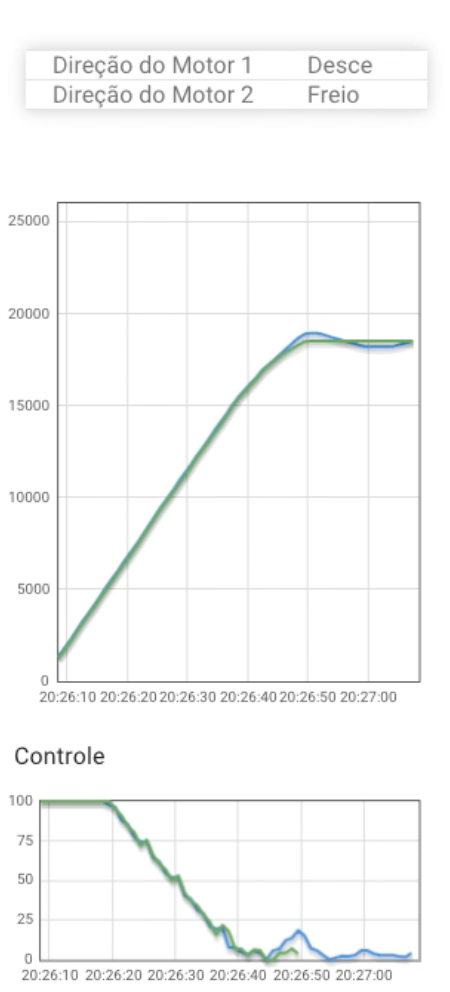
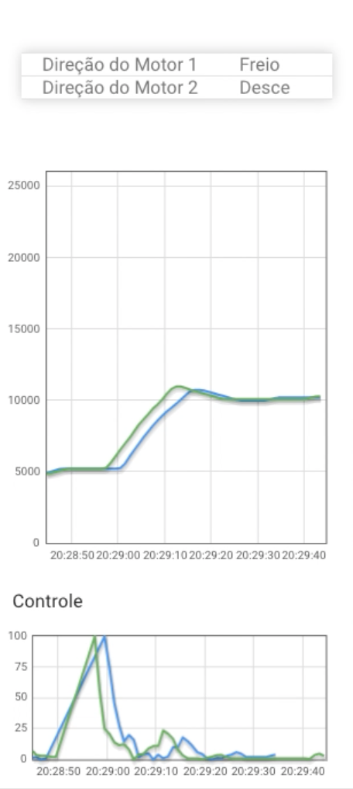
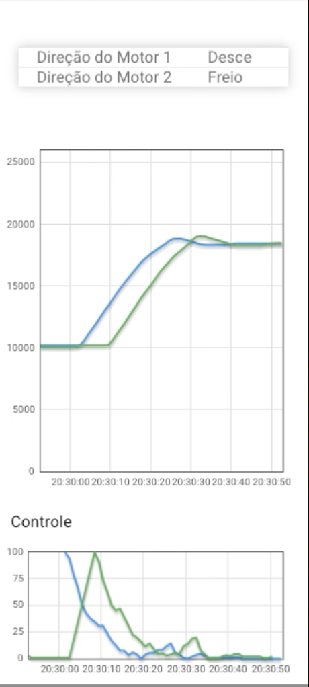
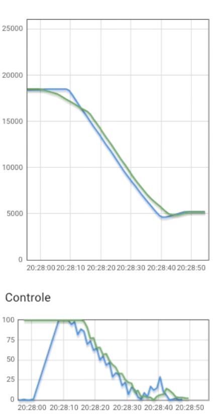

# ELEVADORES - FSE - Trabalho 2 2024/1

## 📈 Gráficos - Testes de funcionamento

| Térreo P/ 3 Andar | 1 Andar P/ 2 Andar | 2 Andar P/ 3 Andar | 3 Andar P/ 1 Andar |
| :---------------: | :---------------: | :---------------: | :---------------: |
|  |  |  |  |

## ▶️ Vídeo do projeto

 

## ⚙️ Instruções de Execução

🚨 A tela OLED não funcionou bem na RASP43 (Erros de biblioteca) e na RASP 47 (Aparentemente não tem tela)

🚨 RECOMENDAMOS USAR A RASP 48 !!!!!!!!!!!!

Para rodar o código, siga estas instruções:

### Obs Broken Pipe:

Durante algumas execuções do código verificamos que por ser um processo que demora bastante para ser executado, vemos que a placa (Raspberry Pi) derruba a conexão SSH, para evitar recomendamos fortemente o uso da extensão SSHFS do VSCODE (Visual Studio Code), pois ela é mais estável e menos propensa a erros dessa natureza.

### Elevadores

1. Instale as dependências:
   
   `pip install -r requirements.txt`

2. Acesse o dashboard da placa correspondente e clique em reiniciar dashboard:

    

3. Verifique se o dashboard está completamente zerado assim como a foto a seguir:

    

4. Rode o programa com:
    `python elevadores.py`

    4.1 Quando o programa é iniciado pela primeira vez não será detectada nenhuma caligragem dos elevadores, portanto iniciará a calibragem automaticamente. 
    
    A calibragem parará os dois elevadores um pouco após o terceiro andar, sem que o sensor seja ativado. Quando impressa a mensagem: 'Calibragem terminada com sucesso' será criado um arquivo com a calibragem da placa atual, que poderá ser utilizada nas proximas execuções ou não, dependendo da sua vontade!

    4.2 Quando for executado o código e já houver uma calibragem para a placa atual, o programa aguardará a resposta se o usuário deseja usar a calibragem anterior **s** ou **n** se deseja realizar uma nova calibragem.

OBS: 
1. Caso a placa atual não tenha os componentes como: Sensores de temperatura e tela oled serão apresentados erros que tais componentes não estão disponíveis, porém a execução do programa não será afetada.
2. Caso algum dos elevadores trave e não se movimente por uma determinada quantidade de iterações, o programa tentará recuperá-lo durante várias vezes, se não conseguir o próprio programa recomendará o reinício do programa e do dashboard. Todo esse processo é transparente ao usuário por meio do terminal.

# 🔨 Funcionalidades do Projeto

- **Baixíssimo uso de CPU e memória RAM** (testado na Raspberry Pi 3);
- **Botão de emergência** que para o elevador atual e zera toda a fila desse elevador;
- **Calibragem automática dos elevadores**;
- **Controle de 2 elevadores de forma independente**, com o controle dos motores por PWM e PID;
- **Monitoramento em tempo real da posição** de ambos os elevadores e o status (sobe, desce e parado);
- **Monitoramento em tempo real dos botões**, adicionando-os em tempo real na fila de andares que cada elevador deve parar (ordenado por pressionamento dos botões);
- **Monitoramento dos elevadores em tempo real via terminal e tela OLED**;
- **Salvamento de um arquivo de calibragem dos elevadores na placa atual** (arquivo com extensão .calibration), sendo possível utilizá-lo ou não na próxima execução; ⭐ **(DIFERENCIAL)**
- **Solicitação de dados e envio pela UART utilizando MODBUS com CRC e com tolerância a interferências**;
- **Tela OLED apresentando**: status dos elevadores (sobe, desce e parado), andar atual e temperatura de cada elevador;
- **Tratamento de erros de movimentação dos elevadores**; ⭐ **(DIFERENCIAL)**
- **Trata interrupção do teclado (ctrl+c)**, encerrando todas as comunicações com periféricos (UART / I2C / GPIO) e desligando os atuadores (PWM do Motor);
- **Funciona com os sensores de temperatura em modo kernel ou modo normal** (seleção automática).

## ✔️ Técnicas e Tecnologias Utilizadas:

- **Adafruit-SSD1306**: Biblioteca para controlar displays OLED SSD1306, utilizada para exibir informações dos elevadores.

- **bmp280**: Biblioteca para o sensor BMP280, que mede temperatura e pressão atmosférica.

- **JSON (JavaScript Object Notation)**: Utilizado para armazenar e transmitir dados estruturados entre diferentes partes do sistema, como configurações de pinos, mensagens entre servidores, etc.

- **Pillow**: Biblioteca para processamento de imagens em Python, utilizada para criar e manipular imagens e textos no display OLED.

- **Python 3**: Linguagem de programação principal usada para desenvolver ambos os códigos.

- **RPi.GPIO**: Biblioteca Python usada para interagir com os pinos GPIO (General Purpose Input/Output) no Raspberry Pi.

- **smbus2**: Biblioteca para comunicação I2C no Raspberry Pi, utilizada para interagir com sensores e dispositivos que utilizam o protocolo I2C.

- **Signal Handling (Tratamento de Sinais)**: Utilizado para capturar e lidar com sinais específicos do sistema, como o sinal `SIGINT`, gerado quando o usuário pressiona `Ctrl+C`.

- **Threading**: Técnica utilizada para lidar com múltiplas tarefas de forma concorrente, permitindo a execução de operações simultâneas em diferentes partes do código.

- **Visual Studio Code**: Ambiente de desenvolvimento integrado (IDE) usado para escrever, depurar e executar o código Python.

# 👥  Autores

| [ Hugo Rocha de Moura](https://github.com/hugorochaffs) |  [ Samuel Nogueira Bacelar](https://github.com/SamuelNoB) | |
| :---: | :---: | :---: |

## 🔖 Referências

Aqui estão algumas referências e recursos úteis relacionados ao projeto:

- **Documentação do Python**: [https://docs.python.org/3/](https://docs.python.org/3/)
- **RPi.GPIO**: [https://pypi.org/project/RPi.GPIO/](https://pypi.org/project/RPi.GPIO/)
- **Threading em Python**: [https://docs.python.org/3/library/threading.html](https://docs.python.org/3/library/threading.html)
- **Socket Programming**: [https://docs.python.org/3/library/socket.html](https://docs.python.org/3/library/socket.html)
- **JSON**: [https://www.json.org/](https://www.json.org/)
- **Signal Handling**: [https://docs.python.org/3/library/signal.html](https://docs.python.org/3/library/signal.html)
- **Visual Studio Code**: [https://code.visualstudio.com/](https://code.visualstudio.com/)
- **smbus2**: [https://pypi.org/project/smbus2/](https://pypi.org/project/smbus2/)
- **bmp280**: [https://pypi.org/project/bmp280/](https://pypi.org/project/bmp280/)
- **Adafruit-SSD1306**: [https://pypi.org/project/Adafruit-SSD1306/](https://pypi.org/project/Adafruit-SSD1306/)
- **Pillow**: [https://pillow.readthedocs.io/](https://pillow.readthedocs.io/)

